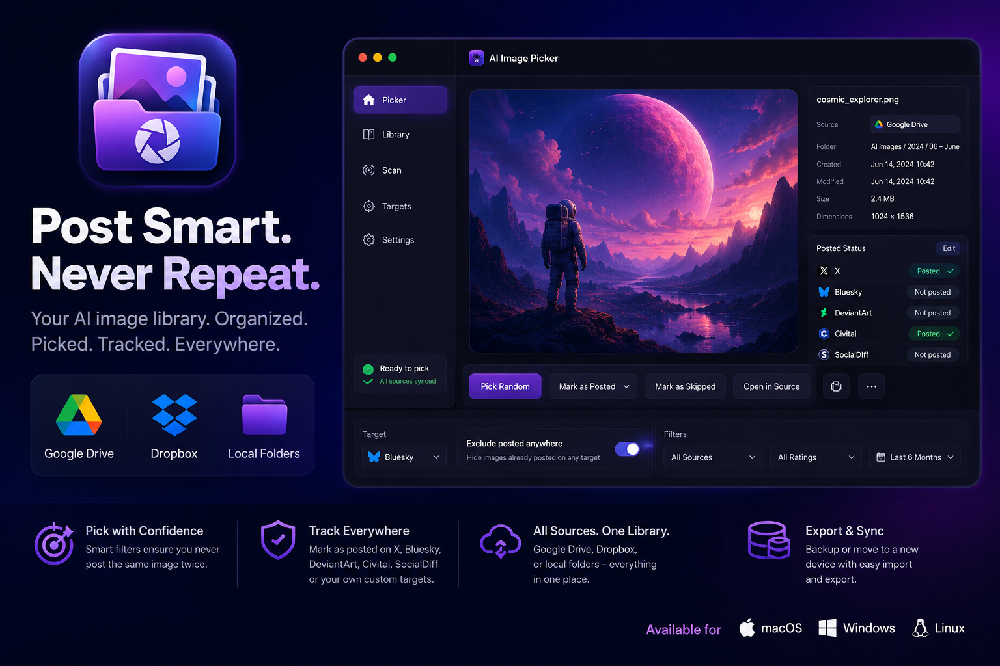
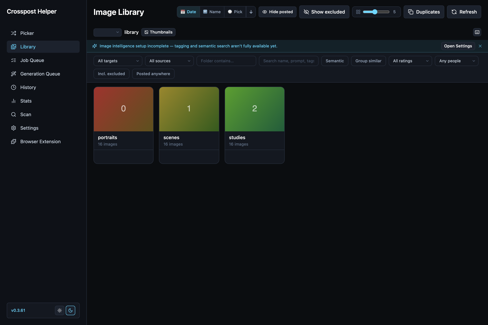
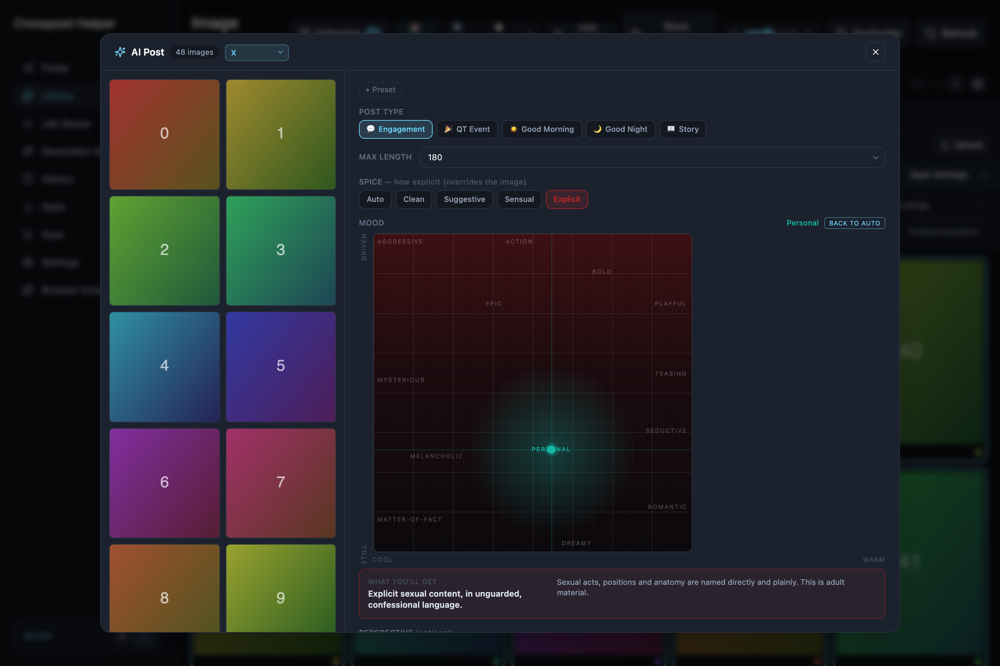

  

<h1 align="center">Crosspost Helper</h1>

  A local-first image library and cross-posting helper for artists. 
  Your library stays on your machine. Nothing is uploaded unless you send it.

  <a href="https://github.com/valerie-4659/crossposthelper-app/releases/latest"><b>⬇ Download</b></a> ·
  <a href="https://github.com/valerie-4659/crossposthelper-app/wiki">Wiki</a> ·
  <a href="CHANGELOG.md">What's new</a> ·
  <a href="https://github.com/valerie-4659/crossposthelper-app/issues">Report a problem</a> ·
  <a href="https://valerie-4659.itch.io/crossposthelper">itch.io</a>

---

## What it does

You have thousands of generated images and a handful of accounts to post them to. The hard parts are not the posting — they are remembering what you already posted where, finding the one image you meant, and writing something to go with it.

**Keeps the library straight.** Point it at your output folders and it indexes them: prompts read out of the PNG metadata, dominant colour, perceptual hashes for near-duplicates. Rescanning only looks at what changed, so an 11,000-image folder takes seconds rather than minutes.

**Helps you choose.** The Picker surfaces what to post next instead of making you scroll. Ratings, folders, colour, people count, "not posted anywhere yet" — filter down to the shortlist, then decide.

**Writes the caption with you.** Two independent dials: how explicit the post is, and how it sounds. Before you spend anything, it says in plain words what those settings will produce.

**Remembers where things went.** Per network, per image. It will not let you post the same picture to the same place twice by accident.

**Hands off to the browser.** A companion extension fills the post page with the image and the text. You look at it and press send — nothing posts itself behind your back.

  
  

## Install

Grab the file for your system from the [latest release](https://github.com/valerie-4659/crossposthelper-app/releases/latest).

| System | File |
|---|---|
| macOS (Apple Silicon) | `.dmg` |
| Windows | `.exe` |
| Linux | `.AppImage` or `.deb` |

### The first launch will warn you

These builds are not code-signed, so the operating system does not recognise the publisher.

- **macOS** — right-click the app, choose **Open**, then confirm. Once is enough.
- **Windows** — SmartScreen shows a blue box. **More info** → **Run anyway**.

That warning is about a missing certificate, not about the file. If you would rather not take that on trust, the [itch.io app](https://itch.io/app) installs and updates it for you.

There is a fuller walkthrough with pictures in the [Installation guide](https://github.com/valerie-4659/crossposthelper-app/wiki/Installation).

## Getting started

1. **Scan** → add the folder your images live in. First scan builds thumbnails; later ones only pick up what changed.
2. **Settings** → add the networks you post to, and an API key if you want AI captions. Keys stay on your machine.
3. **Library** or **Picker** → choose images.
4. **AI Post** → set the tone, generate, edit the text yourself if you like.
5. **Send** → the browser extension fills the post page. You press send.

## Privacy

Everything lives in a local database: the index, the post history, your settings. There is no account, no sync and no telemetry.

The app opens a network connection in exactly three situations, all of them started by you:

- asking an AI provider for a caption, with **your** API key
- checking this page for a newer version
- sending a post

## Something broken?

[Open an issue](https://github.com/valerie-4659/crossposthelper-app/issues/new) and include your platform, the version from the bottom of the sidebar, and what you did just before it went wrong. That is usually enough to find it.

The [Troubleshooting page](https://github.com/valerie-4659/crossposthelper-app/wiki/Troubleshooting) covers the ones that come up most.

## About this repository

This is where the releases, the wiki and the issue tracker live. The source is not public.

---

  Built by Valerie · <a href="https://valerie-4659.itch.io/crossposthelper">itch.io</a>

